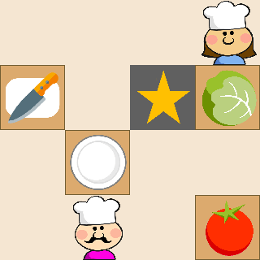
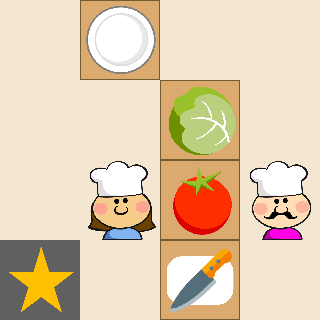
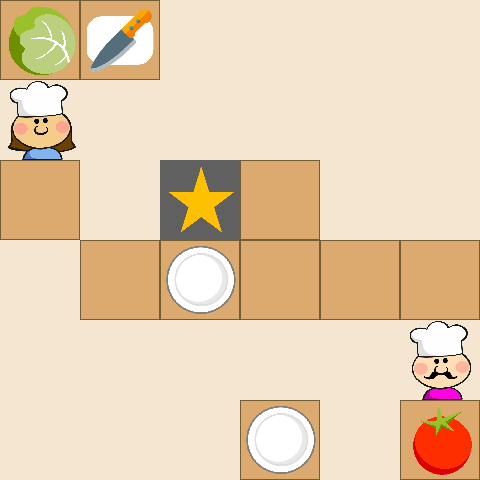
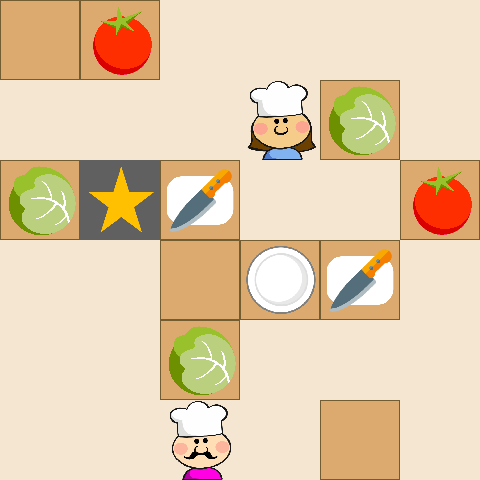
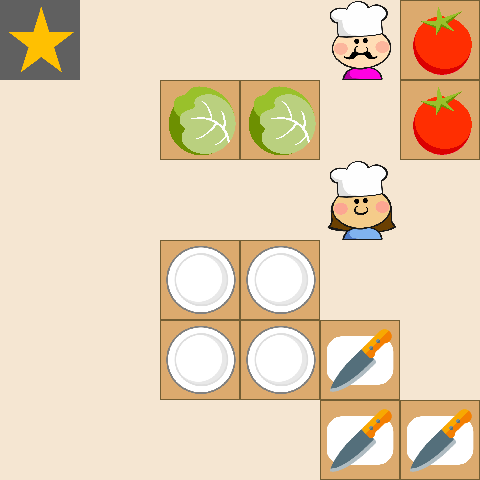
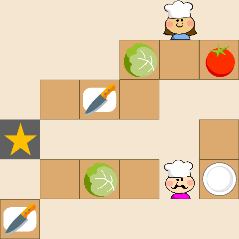

# Code for OvercookedEnvironment (gym-cooking) and Alteration to "Too many cooks: Bayesian inference for coordinating multi-agent collaboration"

<!-- [[Full paper]](https://arxiv.org/abs/2003.11778) [[Journal paper]](https://onlinelibrary.wiley.com/doi/10.1111/tops.12525) [[Video]](https://www.youtube.com/watch?v=Fd4RcVaNthY&ab_channel=RoseWang) -->

The following is a research project carried to create map generation for a multi-agent domain as well as evaluate the effectiveness of a proposed Bayesian Delegation method compared to Reinforcement Learning techniques such as Q-Learning and Policy Gradient. This repository is heavily based upon [https://github.com/rosewang2008/gym-cooking](https://github.com/rosewang2008/gym-cooking), which is about a Bayesian Delegation method for multi-agent collaboration, Winner of the CogSci 2020 Computational Modeling Prize in High Cognition.

Contents:

<!-- - [Introduction](#introduction) -->

- [Installation](#installation)
- [Usage](#usage)
- [Environments and Recipes](docs/environments.md)
- [Design and Customization](docs/design.md)
- [Alterations](#alterations)

<p align="center">
    </img>
    </img>
</p>

<!-- You can use this bibtex if you would like to cite this work (Wu and Wang et al., 2021):

```
@article{wu_wang2021too,
  author = {Wu, Sarah A. and Wang, Rose E. and Evans, James A. and Tenenbaum, Joshua B. and Parkes, David C. and Kleiman-Weiner, Max},
  title = {Too many cooks: Coordinating multi-agent collaboration through inverse planning},
  journal = {Topics in Cognitive Science},
  year = {2021},
  volume = {n/a},
  number = {n/a},
  keywords = {Coordination, Social learning, Inverse planning, Bayesian inference, Multi-agent reinforcement learning},
  doi = {https://doi.org/10.1111/tops.12525},
  url = {https://onlinelibrary.wiley.com/doi/abs/10.1111/tops.12525},
}
``` -->

## Installation

You can install the dependencies with `pip3`. It is recommended that these are installed in a virtual environment:

```
git clone https://github.com/YusufYacoobali/overcook.git
cd gym-cooking
pip3 install -e .
```

All experiments have been run with `python3`!

## Usage

Here, we discuss how to run a single experiment, run our code in manual mode, and re-produce results in our paper. For information on customizing environments, observation/action spaces, and other details, please refer to our section on [Design and Customization](docs/design.md)

For the code below, make sure that you are in **gym-cooking/gym_cooking/**. This means, you should be able to see the file `main.py` in your current directory.

<p align="center">
    </img>
    </img>
    </img>
    </img>
</p>

### Running an experiment

The basic structure of our commands is the following:

`python main.py --dish <dish> --num-agents <number> --model1 <model name> --model2 <model name> --model3 <model name> --model4 <model name> --grid-size <map size> --grid-type <map type> --eps <episodes>`

where `<dish>` is the name of a dish, where it is either Salad, SimpleTomato or SimpleLettuce, `<number>` is the number of agents interacting in the environment (we handle up to 4 agents), `<map size>` is a single number between 4 to 20 for a square grid, `<map type>` is a single character being t, o, s, r for mandatory collaboration, optional collaboration, spread tasks and random respectively, `<episodes>` being a number for how many training episodes to run if the user selects a Reinforcement Learning method for the agents, omitting the `.txt`.

The `<model name>` are the names of models described in the paper. Specifically `<model name>` can be replaced with:

- `bd` to run Bayesian Delegation,
- `up` for Uniform Priors,
- `dc` for Divide & Conquer,
- `fb` for Fixed Beliefs,
- `greedy` for Greedy,
- `ql` for Q-Learning, and
- `pg` for Policy Gradient.

For example, running the salad recipe with 2 agents using Q-Learning with 5 episodes to train looks like:
`python3 main.py --dish Salad --num-agents 2 --model1 ql --model2 ql --grid-size 8 --grid-type o --eps 5 --record`

The shortest commands can be (Some parameters have default values set):
`python3 main.py --num-agents 1 --model1 ql --record`

Note that Reinforcement Learning methods cannot be mixed with the other methods. If using Reinforcement Learning, all agents have to using the same method.

Although our work uses object-oriented representations for observations/states, the `OvercookedEnvironment.step` function returns _image observations_ in the `info` object. They can be retrieved with `info['image_obs']`.

### Additional commands

The above commands can also be appended with the following flags:

- `--record` will save the observation at each time step as an image in `misc/game/record`.

### Manual control

To manually control agents and explore the environment, append the `--play` flag to the above commands. Specifying the model names isn't necessary but the level and the number of agents is still required. For instance, to manually control 2 agents with the salad task on the open divider, run:

`python3 main.py --dish SimpleTomato --num-agents 2 --model1 bd --model2 bd --play`

This will open up the environment in Pygame. Only one agent can be controlled at a time -- the current active agent can be moved with the arrow keys and toggled by pressing `1`, `2`, `3`, or `4` (up until the actual number of agents of course). Hit the Enter key to save a timestamped image of the current screen to `misc/game/screenshots`.

### Reproducing paper results

To run our full suite of computational experiments (self-play and ad-hoc), we've provided the scrip `run_experiments.sh` that runs our experiments on 20 seeds with `2` agents.

To run on `3` agents, modify `run_experiments.sh` with `num_agents=3`.

### Creating visualizations

To produce the graphs from our paper, navigate to the `gym_cooking/misc/metrics` directory, i.e.

1. `cd gym_cooking/misc/metrics`.

To generate the timestep and completion graphs, run:

2. `python make_graphs.py --legend --time-step`
3. `python make_graphs.py --legend --completion`

This should generate the results figures that can be found in our paper.

Results for homogenous teams (self-play experiments):


Results for heterogeneous teams (ad-hoc experiments):


## Alterations

This section outlines where changes were made:

- map.py was added.
  This holds all the code for the map generation.

- network.py was added.
  This is a neural network used for when agents select the Policy Gradient method.

- agents.py was modified.
  The implementation for adding the two additional methods, Q-Learning and Policy Gradient, were carried out. The changes include lines 52-61, 66-68, 113-153, 173-186, 224-236, 350-398.
- main.py was modified.
  A training loop was added if the agents have a Reinforcement Learning method selected. In addition to this, new input parameters were added and some were removed. Furthermore integration of the map generation is also included in this file. The changes include lines 24-28, 93-149.

- Libraries in the setup file were added.
  This includes important libraries used like PyTorch
